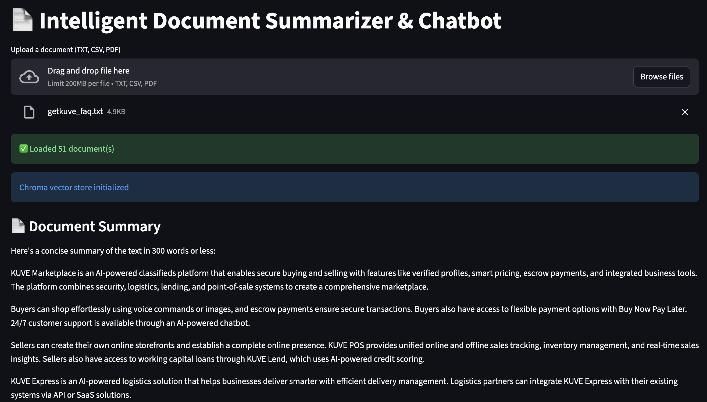

# Intelligent Document Summarizer & Chatbot



## 📌 Problem Statement
Many organizations and individuals struggle to quickly understand the content of large documents (TXT, CSV, PDF). Manually reading and extracting key information is time-consuming and inefficient. Additionally, answering specific questions about a document often requires searching and cross-referencing multiple sections.

**Solution:**  
This project provides a **modular RAG (Retrieval-Augmented Generation) system** that allows users to:
1. Upload documents in multiple formats (TXT, CSV, PDF).  
2. Automatically generate a concise summary.  
3. Interactively ask questions about the document through a chat interface that maintains context.

---

## 🏗 Architecture Overview

The system is modular and divided into four main components:

### 1. **Loader (`loader.py`)**
- Handles document ingestion in multiple formats (TXT, CSV, PDF).  
- Converts each file into `Document` objects compatible with LangChain.

### 2. **Vector Store (`vector.py`)**
- Uses **Chroma** as the vector database.  
- Generates embeddings via **OllamaEmbeddings**.  
- Supports retrieval of the top `k` relevant sections for a given query.

### 3. **Summarizer (`summarizer.py`)**
- Uses **OllamaLLM** to generate concise summaries of the uploaded documents.  
- Integrates seamlessly with multi-document uploads.

### 4. **Chat & RAG (`chat.py`)**
- Retrieves relevant context from the vector store.  
- Uses **OllamaLLM** with a conversation-aware prompt.  
- Maintains multi-turn dialogue using session state.  

### 5. **Streamlit Interface (`app.py`)**
- Provides a web-based interface for:
  - File upload  
  - Document summary  
  - Interactive Q&A  
- Maintains conversation history for seamless user experience.

---

## 🛠 Installation & Setup

1. **Clone the repository**
```bash
git clone https://github.com/Adetayo047/Summarizer_and_QA.git
````

2. **Create a virtual environment**

```bash
python -m venv venv
source venv/bin/activate  # Linux/macOS
venv\Scripts\activate     # Windows
```

3. **Install dependencies**

```bash
pip install -r requirements.txt
```

4. **Prepare your data**

* Place your documents (`.txt`, `.csv`, `.pdf`) in the project folder or upload via Streamlit.

---

## 🚀 Running the App

```bash
streamlit run app.py
```

* Upload a document.
* Wait for the system to generate a **summary**.
* Ask questions using the chat interface.
* Conversation history is preserved for multi-turn dialogue.


## 📂 Project Structure

```
project_root/
│
├─ app.py          # Streamlit app
├─ loader.py       # Load TXT, CSV, PDF documents
├─ vector.py       # Chroma vector store & retriever
├─ chat.py         # Multi-turn RAG chat logic
├─ summarizer.py   # Document summarization module
├─ requirements.txt
└─ README.md
```

---

## 🖼 Streamlit Interface

**[Replace this image with an actual screenshot of your app]**


---

## 💡 How It Works

1. **Upload** your document.
2. The **loader** reads and converts it into `Document` objects.
3. Documents are added to **Chroma vector store** with embeddings.
4. **Summarizer** generates a concise summary.
5. **Chat module** retrieves relevant context and provides answers to user questions.
6. **Streamlit session state** maintains multi-turn conversation.

---

## ⚡ Features

* Supports TXT, CSV, PDF uploads.
* Automatic document summarization.
* Multi-turn chat with context.
* Modular and easily extendable.
* Ready for web deployment via Streamlit.

---

## 📌 Future Improvements

* Support for DOCX, PPTX, and other file formats.
* Highlight most relevant passages retrieved during chat.
* Downloadable summaries.
* Advanced filtering of retrieved sections per question.

---

```

---
